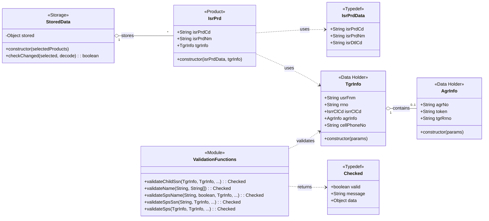

# bhdSlcScript.js Class Diagram

This diagram illustrates the class and function structure of `bot/js/bhdSlcScript.js`.

```mermaid
classDiagram
  direction LR

  class TgrInfo {
    <<Data Holder>>
    +String usrFnm
    +String rrno
    +IsrrClCd isrrClCd
    +AgrInfo agrInfo
    +String cellPhoneNo
    +constructor(params)
  }

  class AgrInfo {
    <<Data Holder>>
    +String agrNo
    +String token
    +String tgrRrno
    +constructor(params)
  }

  class IsrPrd {
    <<Product>>
    +String isrPrdCd
    +String isrPrdNm
    +TgrInfo tgrInfo
    +constructor(isrPrdData, tgrInfo)
  }

  class StoredData {
    <<Storage>>
    -Object stored
    +constructor(selectedProducts)
    +checkChanged(selected, decode) : boolean
  }

  class IsrPrdData {
    <<Typedef>>
    +String isrPrdCd
    +String isrPrdNm
    +String isrDtlCd
  }

  class Checked {
    <<Typedef>>
    +boolean valid
    +String message
    +Object data
  }

  class ValidationFunctions {
    <<Module>>
    +validateChildSsn(TgrInfo, TgrInfo, ...) : Checked
    +validateName(String, String[]) : Checked
    +validateSpsName(String, boolean, TgrInfo, ...) : Checked
    +validateSpsSsn(String, TgrInfo, ...) : Checked
    +validateSps(TgrInfo, TgrInfo, ...) : Checked
  }


  TgrInfo "1" o-- "0..1" AgrInfo : contains
  StoredData "1" o-- "*" IsrPrd : stores
  IsrPrd ..> IsrPrdData : uses
  IsrPrd ..> TgrInfo : uses

  ValidationFunctions ..> TgrInfo : validates
  ValidationFunctions ..> Checked : returns
```
